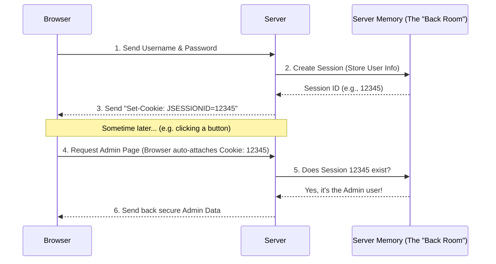
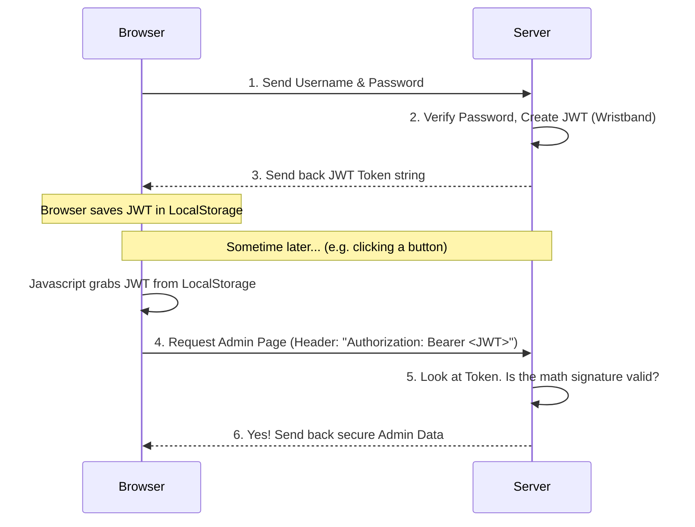

# Session vs Token-Based Authentication

When you log into a website, the server needs a way to remember who you are so you don't have to enter your password on every single page click. There are two main ways to do this: **Session-Based (Cookies)** and **Token-Based (JWT)**.

Here is a simple breakdown of how they work and where the data is stored.

---

## 1. Session-Based Authentication (What we use in Blend Builder)

Think of Session auth like a **coat check at a restaurant**. 
1. You give the server your coat (username/password).
2. The server hangs your coat in a secure back room (Server Memory or Database) and hands you a small ticket (a `JSESSIONID` Cookie).
3. Every time you need something, you just show your ticket (Cookie) to the server. The server looks at the ticket, goes to the back room, and knows it belongs to you.

### Where is it stored?
* **On the Server:** The actual details about your session (who you are, when you logged in) are stored securely on the backend server (either in RAM/memory or in a backend database).
* **In the Browser:** The "ticket" (Cookie) is stored securely in the browser's **Cookie Storage**. You cannot access this ticket using Javascript (which protects it from hackers). The browser automatically attaches this ticket to every request you make.

### Diagram

---

## 2. Token-Based Authentication (JWT)

Think of Token auth like a **VIP wristband at a concert**.
1. You show your ID (username/password) to the bouncer.
2. The bouncer checks your ID, and hands you a VIP wristband (JWT Token) with your name and access level printed directly on it.
3. Every time you want to enter a VIP area, you show your wristband. The security guard doesn't need to check a master list in the back room; they just look at your wristband, see it's valid, and let you in.

### Where is it stored?
* **On the Server:** The server stores **nothing**. It doesn't remember you at all. It just knows how to read the wristband.
* **In the Browser:** The wristband (JWT Token) is usually stored in the browser's **LocalStorage** or **SessionStorage** (sometimes in a Cookie). Your frontend Javascript code has to manually grab this token from LocalStorage and attach it to every single API request (usually in the `Authorization` header).

### Diagram

---

## Summary

| Feature | Session (Cookies) | Token (JWT) |
| :--- | :--- | :--- |
| **Server Storage** | **Yes** (Stores session data in RAM or DB) | **No** (Server is completely stateless) |
| **Browser Storage** | **Cookies** (Browser handles it automatically) | **LocalStorage** (Javascript handles it manually) |
| **Security against XSS** | Highly secure (Cookies can be marked `HttpOnly` so hackers can't steal them) | Less secure (Hackers can write scripts to steal tokens from LocalStorage) |
| **Best used for** | Standard websites where Frontend and Backend are on the same domain | Mobile apps, microservices, or when Frontend and Backend are on totally different domains |

In our **Blend Builder** project, we use **Session (Cookies)** because it is highly secure, built natively into Spring Boot, and saves us from having to write complex Javascript on the frontend to manage tokens!
